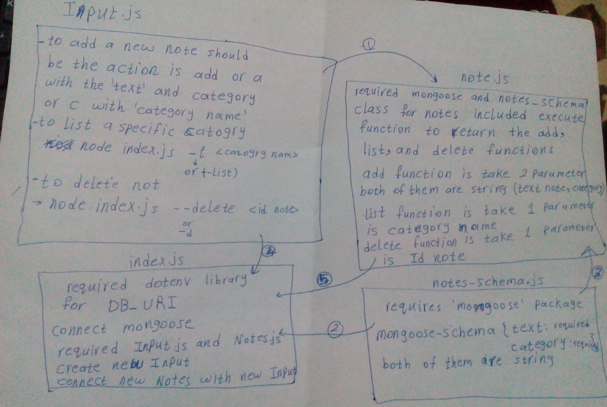

# LAB - Class 03

## Project: Notesy

### Author: Esra'a Mamoun

### Links and Resources

- [submission PR](https://github.com/EsraaMamoun-401-advanced-javascript/notes/pull/1)
- [ci/cd](https://github.com/EsraaMamoun-401-advanced-javascript/notes/actions) (GitHub Actions)
<!-- - [back-end server url](http://xyz.com) (when applicable) -->
<!-- - [front-end application](http://xyz.com) (when applicable) -->

### Setup

#### `.env` 

- `MONGODB_URI` - MONGODB_URI=mongodb://localhost:27017/notesy

### Modules
- input.js
- notes.js

### Packages
- minimist
- mongoose
- supergoose

#### How to initialize/run your application (where applicable)

- `node index.js --add 'your note' --category 'categoru name'`
- `node index.js -a 'your note' -c 'category name'` 
- `node index.js --list 'category name'` 
- `node index.js -l 'category name'` 
- `node index.js --delete 'id note'`
- `node index.js -d 'id note'` 
OR
- `./index.js --add 'your note' --category 'categoru name'`
- `./index.js -a 'your note' -c 'category name'` 
- `./index.js --list 'category name'` 
- `./index.js -l 'category name'` 
- `./index.js --delete 'id note'`
- `./index.js -d 'id note'` 

#### How to use your library (where applicable)
- Lint Tests: `npm run lint`

#### Tests

* How do you run tests?
 > - Jest test: `npm test` - to run the test for two files 
 > - Jest test: `npm test input.test.js`
 > - Jest test: `npm test notes.test.js`
 > - console.log
<!-- - Any tests of note?
- Describe any tests that you did not complete, skipped, etc -->

#### UML

